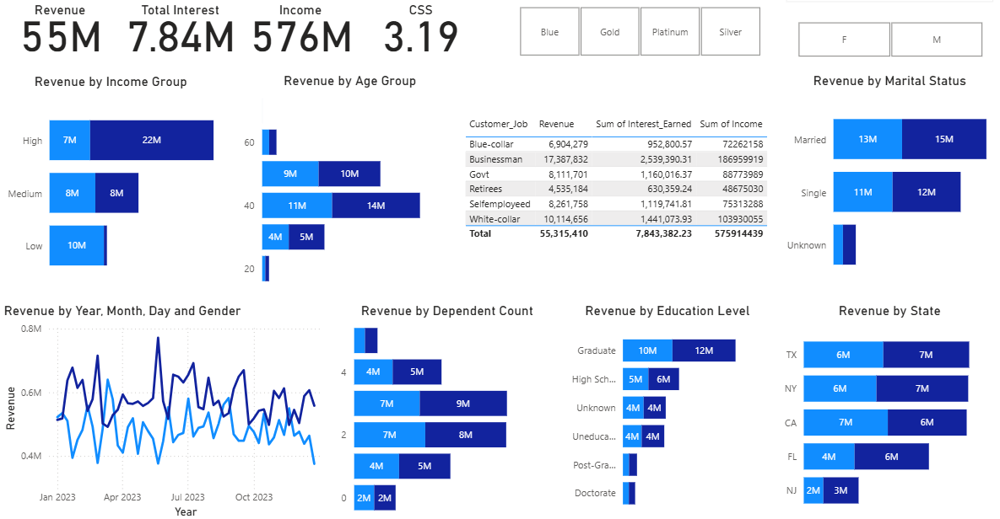
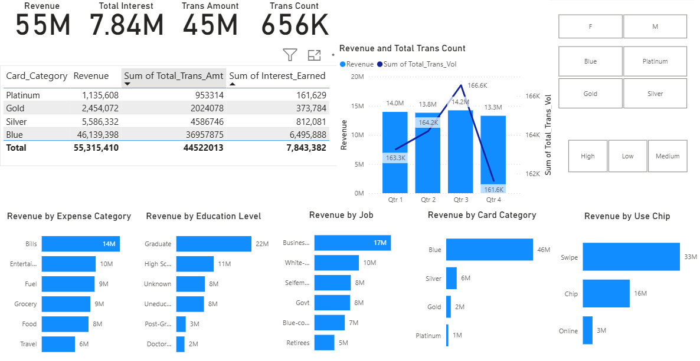

# E-Commerce Customer & Credit Card Analysis

A Power BI report analyzing e-commerce customer demographics and credit card usage/transaction patterns.

## Contents

| Path | Description |
|---|---|
| [`data/customer.csv`](data/customer.csv) / [`.xls`](data/customer.xls) | Customer demographic dataset |
| [`data/credit_card.csv`](data/credit_card.csv) / [`.xls`](data/credit_card.xls) | Credit card transaction dataset |
| [`reports/ECommerceAnalysis.pbix`](reports/ECommerceAnalysis.pbix) | Power BI report file |
| [`screenshots/`](screenshots) | Dashboard screenshots |

## Dashboard Previews

**Customer Report**

**Credit Card Report**

## Usage

Open [`reports/ECommerceAnalysis.pbix`](reports/ECommerceAnalysis.pbix) in [Power BI Desktop](https://powerbi.microsoft.com/desktop/) to explore the report interactively.
